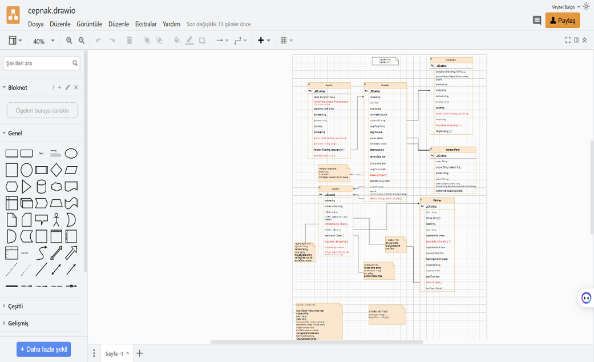
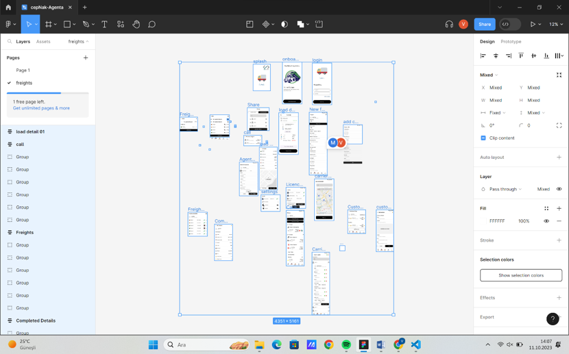
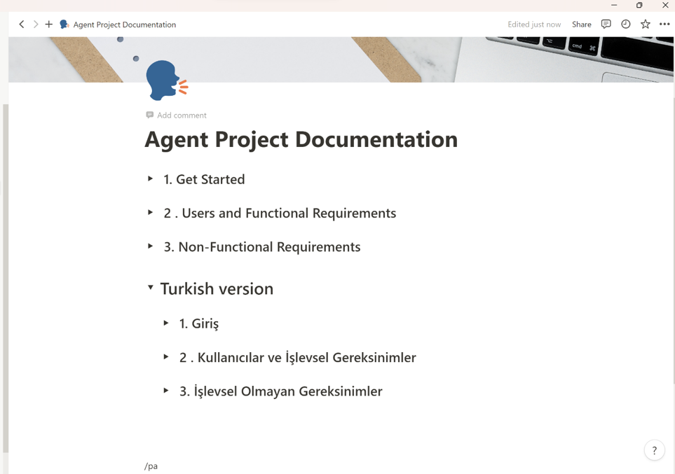

# Cepnak-Agenta Internship Project (2023)

This repository contains the source code, designs, and documentation for the Cepnak-Agenta project, developed as part of my second mandatory internship in 2023. The project focuses on automating load transportation processes in Turkey, featuring a Flutter mobile application, database and UI designs, and comprehensive requirements documentation. All resources and deliverables from the internship are organized in this repository for reference and future development.

# Agency-main Directory Structure

This repository contains all files and resources related to the Cepnak-Agenta internship project. Below is an overview of the main folders and their contents:

## Folders

- **Cepnak-Agenta Main/**
  - The main Flutter project folder. Contains all source code, assets, and platform-specific files for the Cepnak-Agenta application.
  - Key subfolders:
    - `agency/` : Main Flutter application code and assets
    - `agency/lib/` : Dart source files (screens, widgets, logic)
    - `agency/images/` : Image assets used in the app
    - `agency/android/`, `agency/ios/`, `agency/web/`, etc.: Platform-specific files

- **Cepnak-Agenta Draw.io Database Design/**
  - Contains Draw.io files and exports for the database schema and system diagrams.
  - Useful for understanding the backend and data structure.

- **Cepnak-Agenta-Project Figma Design/**
  - Contains Figma design exports (PNG, SVG, PDF) for the app's UI.
  - Useful for UI/UX reference and further development.

- **Media/**
  - Contains general project images and documentation visuals for quick reference.
  - Example files:
    - `draw.io_designimage.png` : Database or system design diagram
    - `figmadesignimage.png` : Figma UI design sample
    - `notionsrsimage.png` : SRS or requirements documentation visual

## Media Previews

Below are previews of the main images in the `media/` folder:

| Draw.io Design | Figma Design | SRS/Notion Visual |
|---|---|---|
|  |  |  |

## Notes
- Each folder is self-contained and named for clarity.
- The main development and codebase is under `Cepnak-Agenta Main/agency/`.
- Design and documentation resources are provided for reference and future work.

---

---

# Cepnak-Agenta Zorunlu 2. Staj Projesi (2023)

Bu depo, 2023 yılındaki ikinci zorunlu stajım kapsamında geliştirdiğim Cepnak-Agenta projesinin kaynak kodlarını, tasarımlarını ve dokümantasyonunu içerir. Proje, Türkiye'de yük taşıma süreçlerini otomatikleştirmeye odaklanır ve Flutter mobil uygulaması, veritabanı/arayüz tasarımları ile kapsamlı gereksinim dokümanlarını içerir. Staj sürecindeki tüm çıktılar ve kaynaklar bu repoda düzenli şekilde sunulmuştur.

# Klasör Yapısı (Türkçe)

Bu depo, Cepnak-Agenta staj projesine ait tüm dosya ve kaynakları içerir. Aşağıda ana klasörlerin ve içeriklerinin kısa açıklamaları yer almaktadır:

## Klasörler

- **Cepnak-Agenta Main/**
  - Ana Flutter proje klasörüdür. Tüm kaynak kodları, varlıklar ve platforma özel dosyalar burada bulunur.
  - Alt klasörler:
    - `agency/` : Ana Flutter uygulama kodları ve varlıklar
    - `agency/lib/` : Dart kaynak dosyaları (ekranlar, widgetlar, mantık)
    - `agency/images/` : Uygulamada kullanılan görseller
    - `agency/android/`, `agency/ios/`, `agency/web/` vb.: Platforma özel dosyalar

- **Cepnak-Agenta Draw.io Database Design/**
  - Veritabanı şeması ve sistem diyagramları için Draw.io dosyalarını ve çıktıları içerir.
  - Backend ve veri yapısını anlamak için faydalıdır.

- **Cepnak-Agenta-Project Figma Design/**
  - Uygulamanın arayüz tasarımlarına ait Figma çıktıları (PNG, SVG, PDF) burada bulunur.
  - UI/UX referansı ve geliştirme için kullanılabilir.

- **Media/**
  - Genel proje görselleri ve dokümantasyon görselleri için kullanılır.
  - Örnek dosyalar:
    - `draw.io_designimage.png` : Veritabanı veya sistem tasarım diyagramı
    - `figmadesignimage.png` : Figma arayüz tasarım örneği
    - `notionsrsimage.png` : SRS veya gereksinim dokümanı görseli

## Media Önizlemeleri

`media/` klasöründeki ana görsellerin önizlemeleri aşağıdadır:

| Draw.io Tasarım | Figma Tasarım | SRS/Notion Görsel |
|---|---|---|
|  |  |  |

## Notlar
- Her klasör kendi içinde düzenli ve açıklayıcı şekilde adlandırılmıştır.
- Ana geliştirme ve kod tabanı `Cepnak-Agenta Main/agency/` altındadır.
- Tasarım ve dokümantasyon kaynakları referans ve ileri geliştirme için eklenmiştir.

---

Daha fazla detay için, `Cepnak-Agenta Main/` içindeki README dosyasına bakabilirsiniz.
